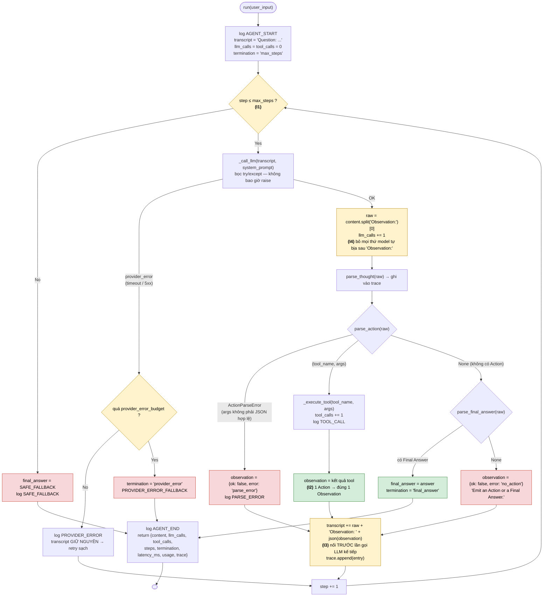
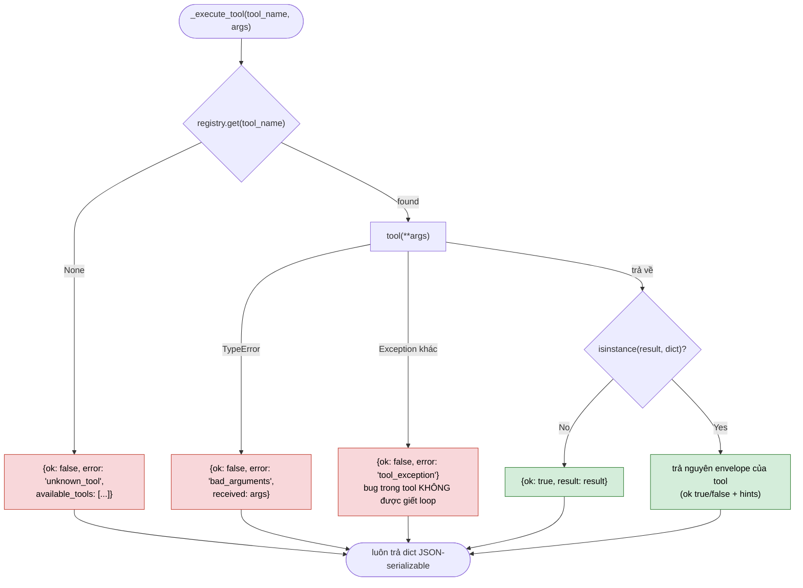
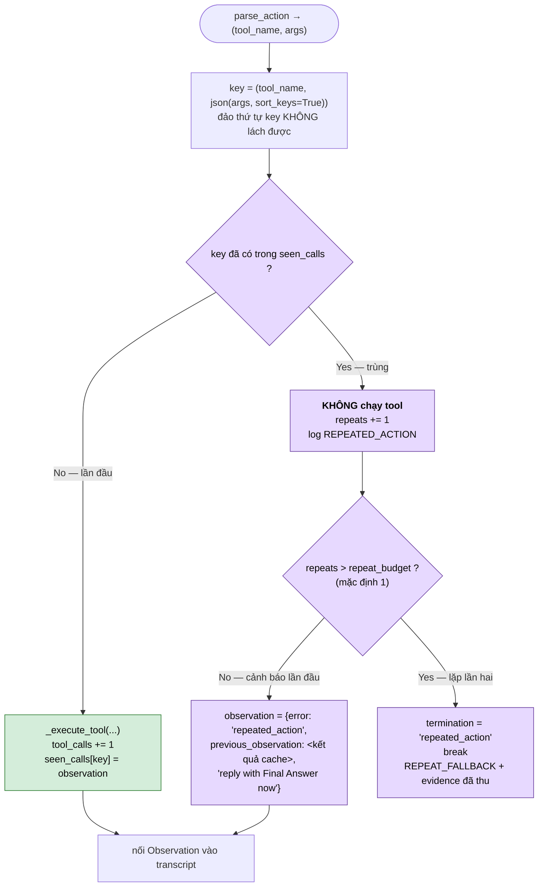
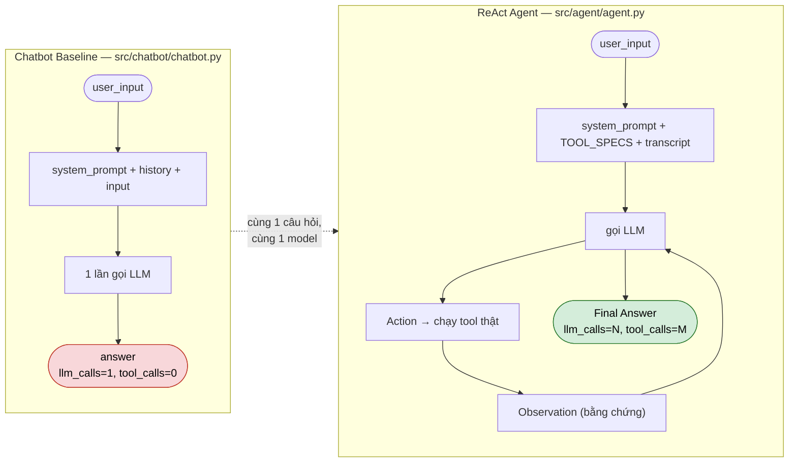
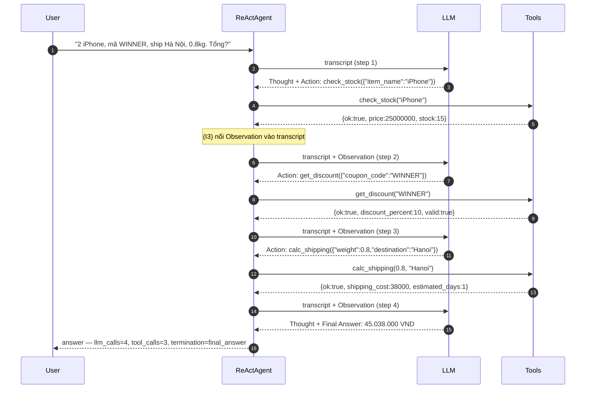

# ReAct Agent — Logic Flowchart

Sơ đồ bám sát `ReActAgent.run()` trong `src/agent/agent.py`. Bốn invariant được đánh dấu
**(I1)–(I4)** ngay tại vị trí code thực thi chúng.

| # | Invariant | Thực thi ở đâu |
| :-- | :--- | :--- |
| I1 | Không vòng lặp vô hạn — mọi run bị chặn bởi `max_steps` | `for step in range(1, max_steps + 1)` |
| I2 | Đúng **một** Observation cho mỗi Action | mỗi nhánh trong loop đều kết thúc bằng đúng 1 lần nối `Observation:` |
| I3 | Observation được nối vào prompt **trước** lần gọi LLM kế tiếp | `transcript += ...` rồi mới `continue` |
| I4 | **Ứng dụng** viết Observation, không phải model | `content.split("Observation:")[0]` |

> Sơ đồ 1–2 và 5 mô tả `ReActAgent` (V1). Sơ đồ 3 là điểm khác biệt duy nhất của `ReActAgentV2`.
> Guard lỗi provider nằm ở `_call_llm()` của lớp cha nên **cả hai version dùng chung**.

---

## 1. Vòng lặp chính — Thought / Action / Observation

**Điểm mấu chốt:** cả ba nhánh lỗi *của model* (`parse_error`, `no_action`, tool trả `ok:false`) đều
**không thoát vòng lặp** — chúng biến thành Observation có cấu trúc và quay lại cho model tự sửa.
Chỉ lỗi *hạ tầng* (provider chết liên tiếp) mới cắt ngang.

Vòng lặp có đúng **ba** lối ra: `final_answer`, `max_steps`, `provider_error`. V2 thêm lối ra thứ tư
là `repeated_action` (sơ đồ 3).

Lưu ý về lỗi provider: transcript **không** bị thay đổi khi retry — bước sau gửi lại đúng chuỗi cũ,
nên observation đã thu được không mất. Nhưng mỗi lần lỗi vẫn **tiêu một step**, nếu không thì một
provider hỏng liên tục sẽ vô hiệu hoá `max_steps` và phá vỡ invariant I1.

---

## 2. `_execute_tool()` — mọi lỗi đều là DATA, không bao giờ raise

Mỗi envelope lỗi đều kèm **hint** (`available_tools`, `received`, `available_items`,
`supported_destinations`) — đó là thứ cho phép Agent tự phục hồi thay vì lặp lại đúng lời gọi hỏng.

---

## 3. V2 — repeated-action detector (khác biệt duy nhất so với V1)

V1 chạy lại mọi action nó nhận được; lời gọi trùng trả observation trùng nên transcript không có thêm
thông tin — livelock chỉ `max_steps` phá được. V2 chặn ngay tại đó. Đo trên cùng script, `max_steps=8`:
`llm_calls` 8→5, `tool_calls` 8→3, lời gọi trùng bị thực thi 5→**0**, tokens 960→600.

---

## 4. Chatbot Baseline vs ReAct Agent

Baseline có `tool_calls == 0` **về mặt cấu trúc**, nên với case multi-step nó chỉ còn hai kết cục
trung thực: thú nhận không biết, hoặc bịa số. Agent đi qua vòng Observation nên đến được ground truth
**45.038.000 VND** (2 × 25.000.000 − 10% + 38.000 phí ship).

---

## 5. Trace mẫu — case multi-step (đường đi lý tưởng)

